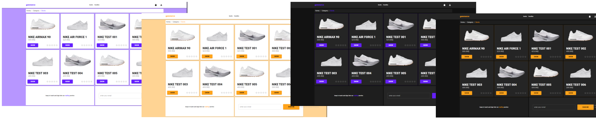

# Gommerce

Ecommerce powered by microservice written in **GO** and **React** base on **Material Design** 
with **MUI** implementation. Ease extendable, you need new functionality? Declare new microservice and 
follow project pattern while building it. That's it! 

### One application many shades!
Make your own theme
Choose **spacing**, **colors**, **fonts**, **layouts**, **sizing**, **images**, **content**, **animations** and much more, to make your store unique, without coding.

### One admin panel to manage.
Manage microservices that runs under your store in easy way using Gommerce Admin Panel.
